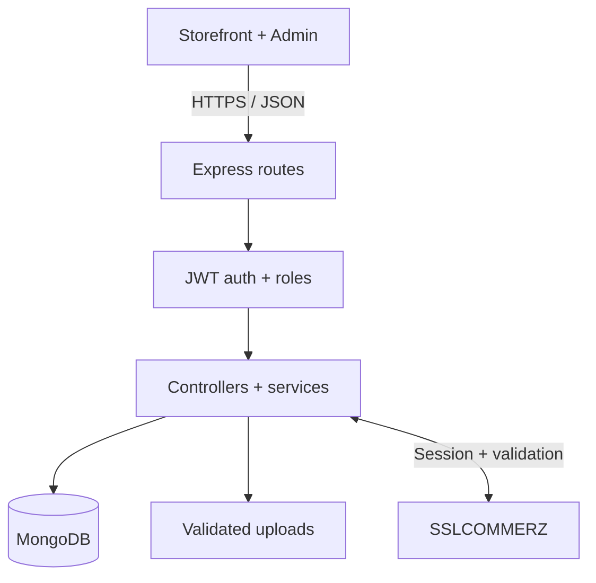
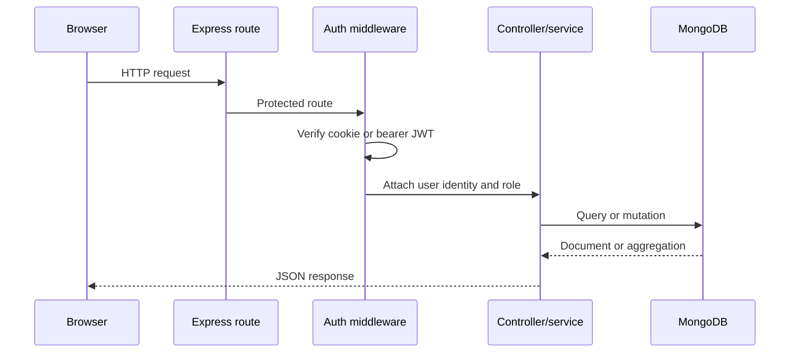
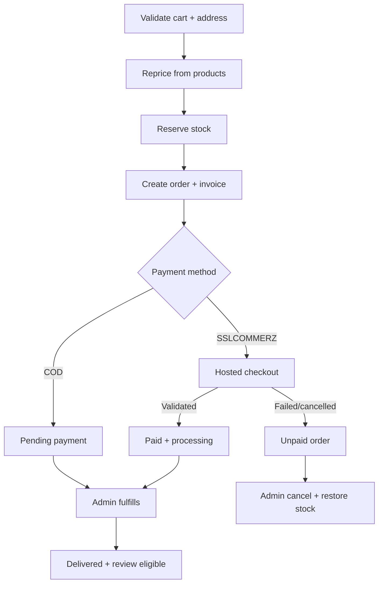

# Norda v2 — Architecture and Data Model

## System view

`server/app.js` assembles middleware and routes without opening a port, which keeps composition testable. `server/server.js` validates the environment, connects MongoDB and then listens. Controllers translate HTTP input and output; services own totals, stock, invoice and gateway rules.

## API request flow

Public catalog routes bypass authentication. Protected routes call `protect`; administrator routes call `protect` and then `adminOnly`.

## Checkout and order lifecycle

Stock is reserved at order creation for both payment methods. A failed online payment therefore creates a visible unpaid order, matching the supplied operational flow. The administrator decides whether to investigate or cancel it. Cancellation is restricted to unpaid pending/processing orders and restores each item once.

## Order and payment states

| Concern | States | Authority |
|---|---|---|
| Fulfillment | pending, processing, shipped, delivered, cancelled | Administrator, constrained by transition map |
| Order payment | pending, paid, failed, cancelled | Validated gateway callback/IPN, or administrator for COD only |
| Gateway transaction | initiated, paid, failed, cancelled, review, error | Payment service |
| Invoice payment | pending, paid, failed, cancelled | Synchronized from order payment state |

Keeping payment separate from fulfillment prevents a failed charge from appearing as a cancelled shipment and prevents a shipped order from implying that online payment was validated.

## Collections

| Collection | Key data and purpose |
|---|---|
| `users` | Identity, hashed password, role and default address |
| `categories` | Managed catalog grouping and unique slug |
| `brands` | Managed name/slug, description, optional logo and visibility |
| `products` | Catalog content, current prices, stock, category, brand reference/name snapshot, images and rating aggregates |
| `carts` | One customer-owned set of product, quantity and refreshed price lines |
| `orders` | Customer, immutable line snapshots, address, totals, fulfillment/payment states and cancellation/restock metadata |
| `invoices` | One-per-order immutable billing snapshot and synchronized payment state |
| `payments` | Gateway transaction, expected amount/currency, validation metadata, risk and outcome |
| `reviews` | Unique customer/product review, rating, comment and verified-purchase flag |
| `uploads` | Stored-file metadata and administrator ownership |

## Important integrity choices

- Product `brandRef` is authoritative for filtering; `brand` retains the display snapshot needed by older data.
- Order and invoice lines are embedded because they belong to exactly one historical purchase and must not change with the catalog.
- Prices, totals, roles, paid state and transaction IDs are server-controlled.
- Product stock reservation uses conditional decrement (`stock >= requested quantity`) per line.
- If an order attempt fails after partial reservation, completed decrements are compensated.
- Cancellation claims `stockRestored: false` before incrementing inventory; repeat requests cannot restore twice.
- CSV output quotes all cells and prefixes formula-like cells.

## Deployment topology

The recommended v2 topology is one Express origin serving both `client/` and `/api`. It simplifies cookies and CORS. If the static client is hosted separately, set `window.NORDA_API_URL`, allow the exact client origin in `CLIENT_URL`, use HTTPS, review cookie `SameSite` policy and test credentials end to end.

For production, replace local `server/uploads` with durable object storage and a malware/image-processing pipeline. Run the API behind TLS, use a managed MongoDB replica set, centralize logs and metrics, and keep secrets in the deployment platform rather than files.
